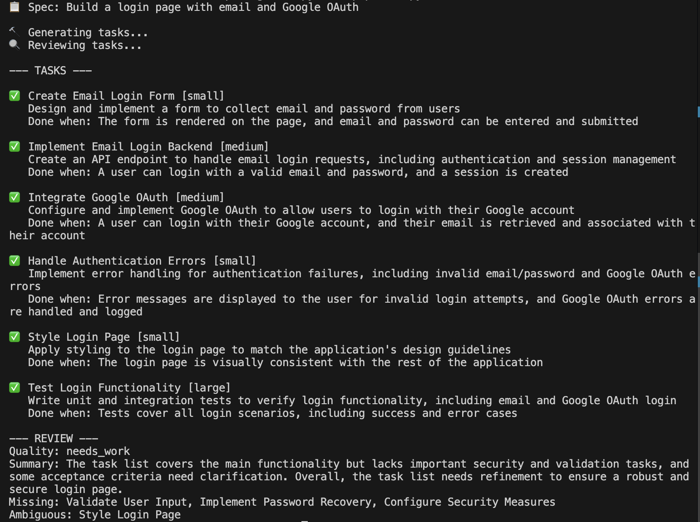

# Spec Agent

A two-agent pipeline that takes a plain English feature spec and breaks it down into structured dev tasks, then critiques its own output.

## What it does

1. **Generator agent**: takes a feature description and returns a structured list of tasks, each with a title, description, acceptance criteria, and effort estimate
2. **Reviewer agent**: independently critiques the task list, flagging missing tasks, ambiguous acceptance criteria, and giving an overall quality verdict

This model works because splitting generation and review into separate agents produces better results than asking a single prompt to do both! Often times, the reviewer catches gaps the generator misses.

## Example

Input: "Build a login page with email and Google OAuth"

Output:
- 6 structured tasks covering frontend, backend, OAuth integration, error handling, styling, and tests
- Reviewer flagged missing: input validation, password recovery, security configuration
- Overall quality: needs_work



## Initiative

I built this after learning about harness engineering (the idea that an AI agent is only as good as the infrastructure around it). This project is a small demonstration of that, in which two agents with distinct roles produce more reliable output than one.

## How to run

```bash
pip3 install groq
export GROQ_API_KEY="your-key-here"
python3 pipeline.py
```

## Tech
- Python
- Groq API (llama-3.3-70b-versatile)
- No frameworks: only direct API calls

The pipeline logic and system design were implemented by me, with AI used as a tool for debugging.